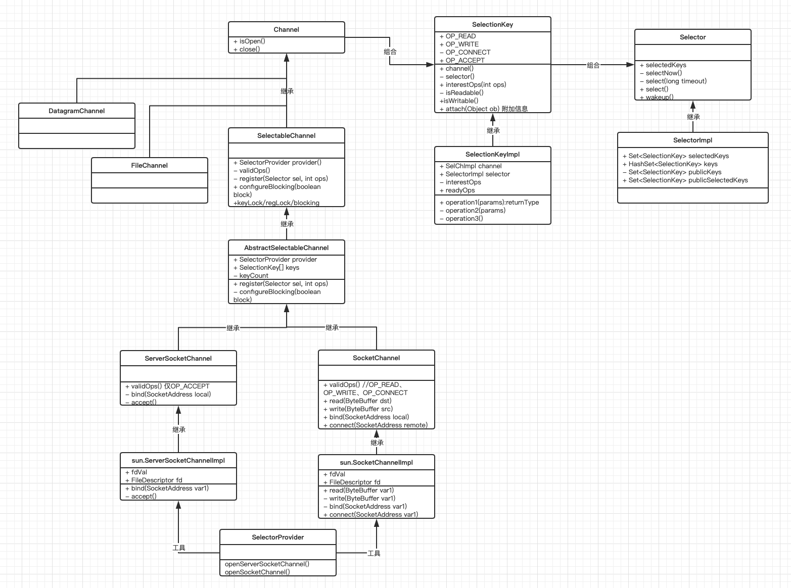

# selector类图



# selector用例
```
package com.liberty.selector;

import java.io.IOException;
import java.io.RandomAccessFile;
import java.net.InetSocketAddress;
import java.nio.ByteBuffer;
import java.nio.channels.*;
import java.nio.channels.spi.SelectorProvider;
import java.util.Iterator;
import java.util.Set;

/**
 * Selectors case
 */
public class Server {
    public static void main(String... args) throws IOException {
        SelectorProvider provider = SelectorProvider.provider();
        final Selector selector = provider.openSelector();

        new Thread(new Runnable() {
            @Override
            public void run() {
                while(true){
                    try {
                        int select = selector.select(1000);
                        if(select == 0){
                            System.out.print(".");
                            continue;
                        }
                        Set<SelectionKey> selectedKeys = selector.selectedKeys();
                        Iterator<SelectionKey> keyIterator = selectedKeys.iterator();
                        while(keyIterator.hasNext()) {
                            SelectionKey key = keyIterator.next();
                            if (key.isReadable()) {
                                SocketChannel channel = (SocketChannel)key.channel();
                                ByteBuffer bb = ByteBuffer.allocate(48);
                                while(channel.read(bb) != -1){
                                    bb.flip();
                                    while(bb.hasRemaining()){
                                        System.out.println(bb.get());
                                    }
                                    bb.clear();
                                }
                                channel.close();
                            }else if(key.isWritable()){

                            }
                            keyIterator.remove();
                        }
                    } catch (Exception e) {
                        e.printStackTrace();
                    }
                }
            }
        }).start();

        ServerSocketChannel serverSocketChannel =  provider.openServerSocketChannel();
        serverSocketChannel.bind(new InetSocketAddress("127.0.0.1", 8100));
        while (true){
            SocketChannel socketChannel = serverSocketChannel.accept();
            socketChannel.configureBlocking(false);
            SelectionKey key = socketChannel.register(selector, SelectionKey.OP_READ);
            selector.wakeup();
        }
    }
}

```

```
package com.liberty.selector;

import java.net.InetSocketAddress;
import java.nio.ByteBuffer;
import java.nio.channels.SocketChannel;
import java.nio.channels.spi.SelectorProvider;

public class Client {
    public static void main(String... args) throws Exception {
        SelectorProvider provider = SelectorProvider.provider();
        SocketChannel socketChannel = provider.openSocketChannel();
        socketChannel.connect(new InetSocketAddress("127.0.0.1", 8100));
        ByteBuffer bb = ByteBuffer.allocate(48);
        bb.put("this is a channel".getBytes());
        bb.flip();
        while (bb.hasRemaining()){
            socketChannel.write(bb);
        }
        socketChannel.close();
    }
}

```


