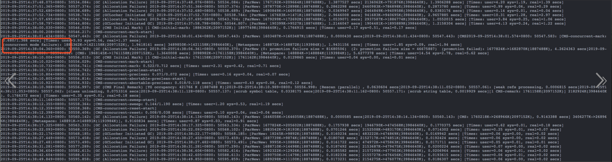
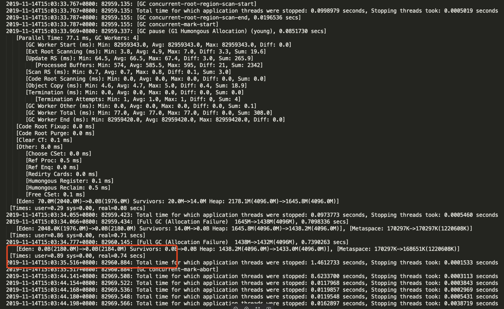
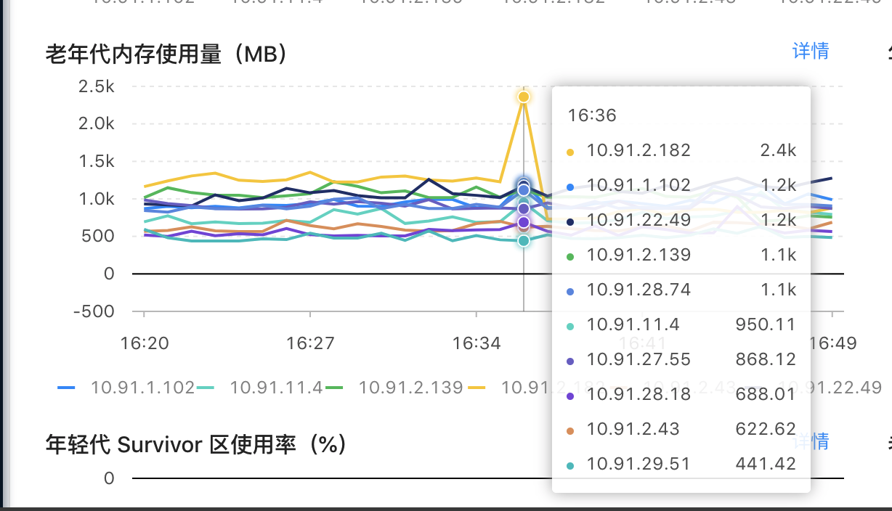

#配置

- 容器数：125
- 规格：4c8g
- 垃圾回收器：ParNew+CMS
- 堆内存：4G
- 老年代：2G
- SurvivorRatio=8
- 线程：256k

#问题

- 因为接入快手，流量从年初的日均1亿到双十一前日均3亿。出现了内存使用率95%，fgc导致机器STW。
订单详情fgc超时问题

#处理

- setup1:

	- 从监控找到告警机器和发生时间，找到gc日志，发生了fgc，并且是concurrent mode failure，这时CMS会切换为Serial Old。
	- 分析gc日志，发现ygc存活的对象太大，有300M以上，survivor区不足以放入，走担保机制进入老年代，因为老年代只有fgc才回收，所以多次ygc放入老年代的对象越来越多，如果最后一次ygc存活对象担保成功，并且触发fgc，那么可以正常回收掉。如果担保失败，那么就会触发concurrent mode failure。
	- CMS是标记清除的，会有大量碎片，但是即使设置CMS定期整理，也还是有可能触发上述情景。
	因为该应用是大数据量查询的，即使调整各区大小，也很难满足，比如survivor区总不能设置500M+吧，总计才4G空间，最多5G。 所以，CMS是在当前场景、当前配置下是无法满足的。
	- 于是考虑其他回收器，仔细研究了G1，综合考虑，决定切换为G1.
	- ps：导致对象很大的原因有以下：
		- 1.导出系统每次100条订单连续拉取。
		- 2.一个订单有多商品，商品越多，订单越大
		- 3.周期购信息，多的一个订单有365+条周期购信息（当初考虑欠缺，将该模块并入了详情）
		- 4.外部开发者通过trade-open系统批量拉取订单，也是100条一次。

- setup2:

	- 在双十一前一周，将垃圾回收器切换为了G1，没有再发生告警。
	- 双十一结束后，各应用的机器要缩容了（在9月底对机器进行了扩容，并且后续又多次调整了机器数量），trade-detail直接收回了一半。然后又有告警了。
	- 这次状况没有之前严重，但是问题依旧存在。
	- 分析发现，在告警时间点，回收的user time和real time比较接近，这意味着只有一个gc线程在处理。正常user time/real time应该是4/1左右，即有4个gc线程处理。
	- 查看配置，-XX:ParallelGCThreads=4 于是，调大了gc线程，设为16，不会有单线程处理了。 但是问题依旧存在。
	- ps：这里要说一个现象，G1同样存在survivor不足，使对象进入老年代的情况。但是从监控上看有1G对象进入老年代，然后被回收，并没有触发fgc。原因在于G1有mix回收模式，会同时回收新生代和老年代。fgc只有在mix来不及回收时才触发。
	- warn: fgc是单线程模式。

- setup3:

	- 考虑到对象比较大，决定调大Region大小为8M，减少HRegion。
	- 然后疯狂告警，赶紧回滚。
	- 分析： 计算了下，一个订单是50kb，100个订单是5M，按region超过50%即拼接HRegion，8M反而导致内存使用率更低了，所以应该16M比较合理。但是4G的话，只有256个Region了，而G1默认的管理数量是2048，数量太少反而可能会降低效率。因为数量少，系统权衡就会比较局限。
- setup4:
	- 所以现在问题是机器配置太低了。
	- 考虑公司是否有更高配置的机器，在ops伸缩容发现有8核16G，果断要切。但是和运维沟通后，如果升级到8核16G，那么机器数量要减半。所以在切换后还需要继续调试性能。
	- 8核16G运维要求拿出性能数据，等测试压测结果。
- setup:5:
	- 运维建议将4G堆调为5G。
	- 切换成5G堆内存后，性能有出乎意料的提升。从周三（20191211 11:00）发布到现在（20191213 11:52），只有一次SWT较长，6次内存>95%。4核8G观察
	- 直观上才增大1个G，好像不大，所以觉得不会有什么效果。但是对于jvm而言增加了25%的堆内存。
	- 实践是检验真理的唯一标准

- setup:6: 再一次30%性能的提升
	- 将系统中的原型改为单例